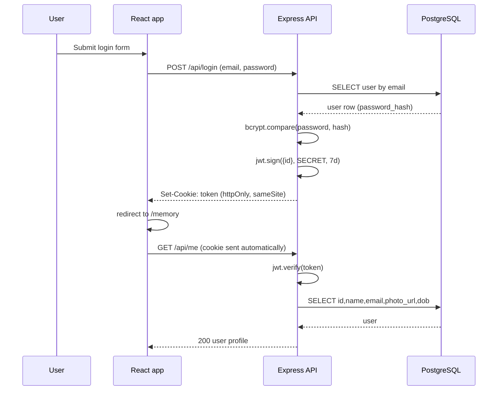
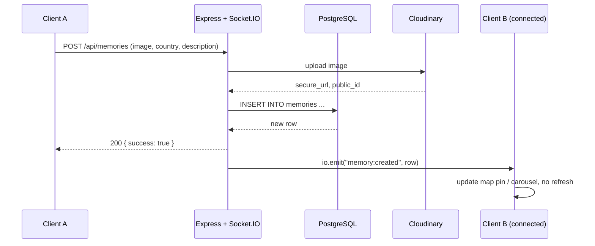
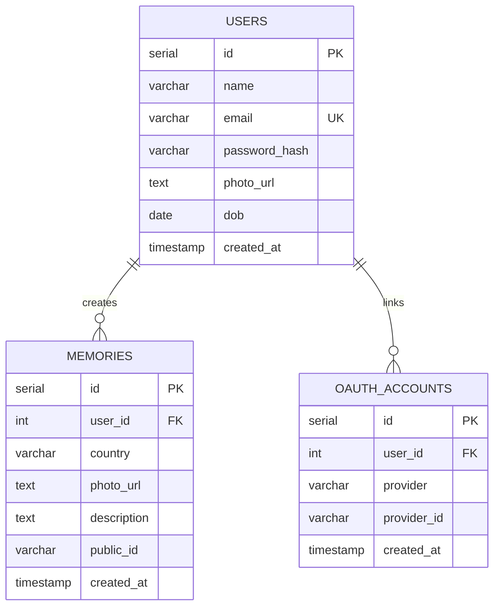

# Momento 

Momento is a full-stack, real-time memory map, drop a photo on the country it belongs to, and watch it appear instantly on an interactive globe for everyone in your circle to see. Watch old past memories of your friends & family.

---

**Live Demo**
- Frontend: https://momento-ebon-phi.vercel.app/
- Backend: https://momento-backend-b3sh.onrender.com/
---

## What it does

- **Accounts & sessions** — sign up, log in, and stay logged in via a secure `httpOnly` JWT cookie
- **Pin memories to the map** — pick a country, upload a photo, add a short description
- **Grouped memory carousels** — multiple memories from the same country stack into a swipeable carousel on the map pin
- **Real-time sync** — new and deleted memories broadcast instantly to every connected client via Socket.IO, no refresh needed
- **Profile management** — update your date of birth and profile photo any time
- **Protected routes** — memory map, memory creation, and profile pages all require an active session

---

## Tech stack

**Frontend**
- React 19 + Vite
- Tailwind CSS (custom glassmorphism UI — `glass-container`, `glow-btn`, `input-dark`)
- `react-router-dom` for routing, with a `ProtectedRoute` wrapper guarding private pages
- `react-globe.gl` + `three.js` for the landing page globe
- Custom canvas-based `Starfield` component for the animated background
- `react-leaflet` + `leaflet` for the world memory map
- `@turf/turf` to compute country centroids for pin placement
- `socket.io-client` for real-time updates
- `framer-motion` for the memory carousel's image transitions
- `lucide-react` for icons

**Backend**
- Node.js + Express 5
- PostgreSQL (hosted on Neon)
- Socket.IO for real-time events, authenticated via the session cookie
- JWT + bcrypt for authentication
- Multer + Cloudinary for image storage
- Cookie-based sessions (`httpOnly`, `sameSite: none`, `secure`)

---

## Project structure

```
family-tracker/
├── public/
│   └── countries.geojson       # Country boundary data used for the map + dropdown
├── src/
│   ├── assets/                
│   ├── Components/
│   │   ├── Login.jsx
│   │   ├── Signup.jsx
│   │   ├── ProfileEdit.jsx
│   │   ├── ProtectedRoute.jsx
│   │   └── StarField.jsx
│   ├── socket/
│   │   └── socket.js            
│   ├── App.jsx                 
│   ├── Home.jsx                 
│   ├── GlobalSection.jsx       
│   ├── Memory.jsx             
│   ├── MemoryCarousel.jsx      
│   ├── CreateMemory.jsx        
│   ├── index.css
│   └── main.jsx
├── db/
│   └── schema.sql             
├── server.js                    
├── cors.json
├── vite.config.js
├── package.json
└── README.md
```

## 2. High-level architecture


- **REST for state changes, WebSocket for fan-out.** Every write (signup,
  login, create/delete memory) goes through a normal HTTP request so it's
  easy to validate, log, and retry. Socket.IO is used *only* to push the
  result of a write to every other connected client it's not a second
  source of truth.
- **Cloudinary instead of storing images in Postgres or on local disk.**
  Keeps the database small and fast, offloads image resizing/CDN delivery,
  and means the app server stays stateless (any instance can serve any
  request important if this ever moves behind a load balancer).
- **Neon (serverless Postgres)** removes the need to manage a database
  server and pairs naturally with a serverless/edge-friendly deploy target.
---
The app runs at `http://localhost:5173`, talking to the API at `http://localhost:4000`.
---
## 3. Request/auth flow
 

 
Session state is **not** stored server-side for normal login the JWT
itself, sitting in an `httpOnly`, `sameSite` cookie, is the session. That
keeps the API stateless for the common path. Google OAuth is layered on top
via Passport, which *does* use a short-lived server session (10 minutes)
purely to complete the OAuth handshake, then also issues the same JWT
cookie at the end (`issueTokenAndRedirect`) so both login paths converge on
one session mechanism for everything after login.
 
---
 
## 4. Real-time sync flow
 

 
The Socket.IO handshake itself is authenticated by reading the JWT out of
the same cookie used for REST (`io.use(...)` middleware), so a socket can't
attach without a valid session.
 
---
 
## 5. Database design
 
### 5.1 Entity-relationship diagram
 

 
### 5.2 Design decisions
 
| Decision | Rationale |
|---|---|
| `email` nullable but `UNIQUE` | Lets an OAuth-only user exist without a password; uniqueness still enforced when an email *is* present. |
| `password_hash` nullable | Distinguishes password accounts from OAuth-only accounts — `/api/login` checks for this and returns a friendly "use Google login" error instead of a generic failure. |
| `oauth_accounts` as a separate table (not columns on `users`) | A user can link more than one provider without schema changes, and `(provider, provider_id)` is a natural unique key for "find or create" lookups on login. |
| `ON DELETE CASCADE` on both FKs | Deleting a user should not leave orphaned memories or dangling OAuth links — enforced at the DB level, not in application code, so it holds even if a row is deleted directly. |
| `country` stored as free text on `memories`, not a `country_id` FK to a countries table | The country list comes from a static `countries.geojson` file bundled with the frontend, not a DB table — so there's nothing to foreign-key against today. This is the clearest place to introduce a proper `countries` reference table if the roadmap items below are tackled. |
| `public_id` stored alongside `photo_url` | Cloudinary needs the `public_id` (not the URL) to delete an asset — storing it at write time avoids parsing it back out of the URL on delete. |
| Passwords hashed with bcrypt, cost factor 10 | Standard, well-understood default; see §7 for the roadmap note on stepping this up. |
 
### 5.3 Indexing
 
- `idx_oauth_provider` on `(provider, provider_id)` — supports the OAuth
  login lookup directly.
- `users.email` — indexed implicitly by the `UNIQUE` constraint, covering
  the login lookup (`WHERE email = $1`).
- **Not yet indexed:** `memories.user_id`. Every memory read and the delete
  ownership check filter on it, and it will be the first index to add as
  data grows (see §7).
---

## How it fits together

- On load, `App.jsx` checks `/api/me` to see if a session cookie is valid, then connects the Socket.IO client and joins a room for that user.
- `Memory.jsx` fetches all existing memories, groups them by country, and computes each country's centroid (via Turf) to place a pin on the Leaflet map.
- Clicking a pin opens a `MemoryCarousel` if that country has one or more memories attached.
- `CreateMemory.jsx` loads the country list from `countries.geojson`, uploads the photo + metadata to `/api/memories`, and the server broadcasts a `memory:created` event so every connected client updates without refreshing.
- Deleting a memory works the same way in reverse, via `memory:deleted`.
---

## API overview

| Method | Endpoint              | Description                          |
|--------|------------------------|---------------------------------------|
| POST   | `/api/signup`          | Create a new account                 |
| POST   | `/api/login`           | Log in and receive a session cookie  |
| POST   | `/api/logout`          | Clear the session cookie             |
| GET    | `/api/me`               | Get the logged-in user's profile     |
| POST   | `/api/me/profile`      | Update DOB / profile photo           |
| GET    | `/api/memories`        | Fetch all memories                   |
| POST   | `/api/memories`        | Upload a new memory (image required) |
| DELETE | `/api/memories/:id`    | Delete a memory you own              |

Real-time events (Socket.IO):
- `memory:created` — a new memory was added
- `memory:deleted` — a memory was removed

---
## Known gaps / roadmap

- [ ] Google / X (Twitter) login buttons exist in the UI but aren't wired up yet — `oauth_accounts` table is ready for this
- [ ] `/api/memories` currently returns *every* memory in the database, not just the logged-in user's family/group
- [ ] Server doesn't yet handle the `"join"` socket event the client emits on connect — currently rooms aren't actually being used
- [ ] Memory editing isn't supported (only create/delete)
- [ ] No mobile-specific layout for the globe or map interactions yet

---

## Future Updates
 
- **Richer image display** — move beyond the current carousel toward a more polished, gallery-style layout for viewing memory photos, with better structure for how images are laid out and scaled on screen
- **Stronger password security** — upgrade from the current bcrypt hashing setup to a more robust encryption/hashing strategy for stored credentials
- **Scalability improvements** — prepare the backend and database to handle a growing number of concurrent users as adoption increases
- **Memory sharing** — let users share individual memories (or their whole map) with people outside their account, via a shareable link or invite
  
---
